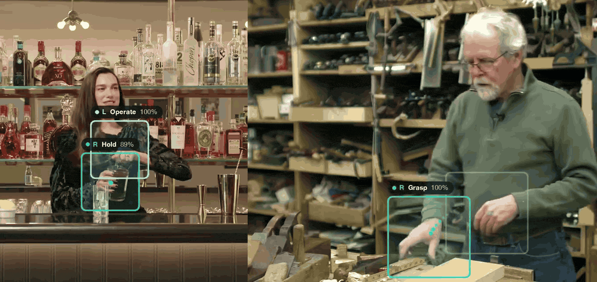

# Hand Action Recognition Demo

[](https://arxiv.org/abs/2409.09319)
[](https://github.com/idiap/childplay_hand)
[](https://zenodo.org/records/14958923)
[](LICENSE)
[](https://colab.research.google.com/github/aryafarkhondeh/cp_hand_demo/blob/main/notebooks/colab_demo.ipynb)

Hand action recognition (hand-object manipulation stages) in everyday videos with Hiera-Hand
([ECCVW 2024](https://arxiv.org/abs/2409.09319)). It tracks
people, localizes their hands, and labels every hand in every frame as
**grasp**, **hold**, **operate**, or **release**.

> <sub>⚠️ This is a standalone demo based on the original research work; for training, evaluation, and the dataset, see [idiap/childplay_hand](https://github.com/idiap/childplay_hand).</sub>



## Install

```bash
./setup_env.sh              # needs uv; Python 3.11 venv in .venv
source .venv/bin/activate
```
Fetch the checkpoints from [Zenodo](https://zenodo.org/records/14958923) into `checkpoints/`:

```bash
python src/download_checkpoints.py              # manipulation (~0.4 GB download)
python src/download_checkpoints.py --task all   # + object (~0.8 GB download)
```

## Run

```bash
python src/demo.py input.mp4 --output result.mp4
```

| Option | Default | |
|---|---|---|
| `--stride N` | 1 | Run Hiera every N frames; 2 ≈ 2× faster |
| `--task` | manipulation | or `object` (object in hand) |
| `--device` | auto | CUDA → MPS → CPU |
| `--batch-size` | 16 / 4 / 2 | CUDA / MPS / CPU |
| `--smoothing-window` | 5 | frames; 0 = off |
| `--save-intermediates` | off | writes `pose.pkl`, `pred.pkl` |

Works best on clips where people are fully visible, without camera cuts.

## How it works (TL;DR)

1. **Track people and their pose**: YOLO26m-pose + BoT-SORT, in one pass.
2. **Find hands**: each hand box sits just past the wrist, along the
   elbow→wrist direction.
3. **Recognize**: for every hand and frame, a ~1 s window (32 frames, 16 sampled)
   is cropped around the hand at 224×224 and fed to **Hiera-Base** (51M params,
   205 MB; MAE-pretrained on Kinetics-400, fine-tuned on ChildPlay-Hand), which
   outputs background / grasp / hold / operate / release.
4. **Display**: smoothed hand boxes and hand actions.

**Note:** The paper used HRNet-W32 for pose; this demo uses YOLO26m-pose for speed, so
predictions may differ slightly from the reported results.

## License

- **Code**: GPL-3.0, based on [idiap/childplay_hand](https://github.com/idiap/childplay_hand) (© Idiap Research Institute).
- **Checkpoints**: CC BY-NC 4.0 (non-commercial), from [Zenodo](https://zenodo.org/records/14958923).
- **Pose model**: [Ultralytics](https://github.com/ultralytics/ultralytics) YOLO26, AGPL-3.0.
- **Hiera architecture** (`src/hiera/`): Apache-2.0, © Meta.

## Citation

```bibtex
@inproceedings{Farkhondeh_ECCVW_2024,
  author    = {Farkhondeh*, Arya and Tafasca*, Samy and Odobez, Jean-Marc},
  title     = {ChildPlay-Hand: A Dataset of Hand Manipulations in the Wild},
  booktitle = {Proceedings of the European Conference on Computer Vision (ECCV) Workshops},
  year      = {2024},
  note      = {* Equal contribution}
}
```
